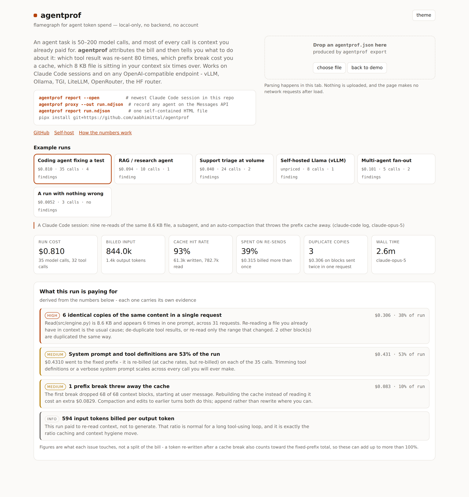
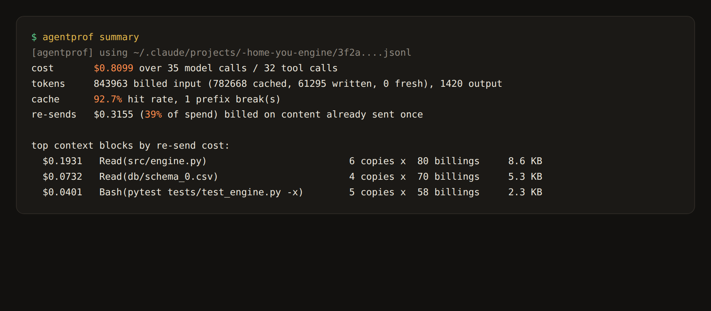
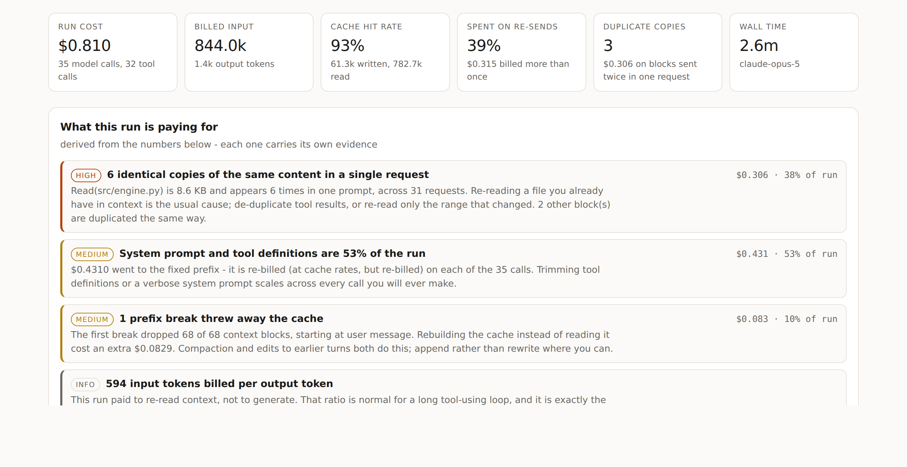
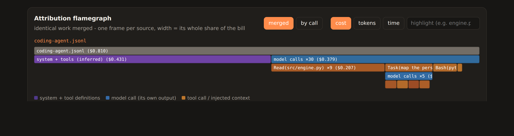
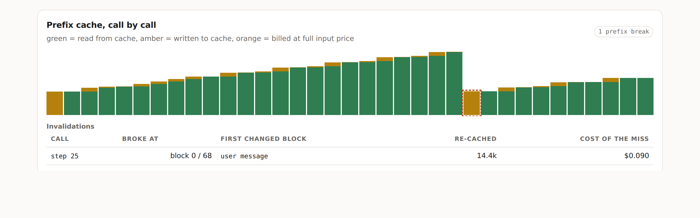
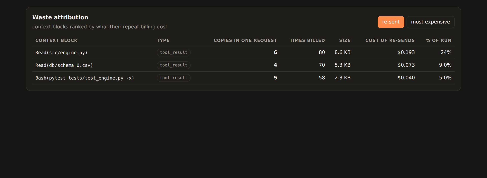

# agentprof

**Flamegraph profiler for agent token spend.** Point it at an agent run and it tells you where the
money went: which tool result got re-sent eighty times, which prefix break threw away your cache,
and how much of the bill is context the model never needed twice.

Works on Claude Code sessions, the Anthropic API, and any OpenAI-compatible endpoint — vLLM,
Ollama, TGI, LiteLLM, OpenRouter, the Hugging Face router.

Local-only. No backend, no account, no telemetry — one self-contained HTML file you can open,
attach to a PR, or email.

[**Live demo**](https://aabhimittal.github.io/agentprof/) · [Sample report](https://aabhimittal.github.io/agentprof/report.html) · MIT



---

## Why

A per-token price feels cheap. A per-*task* price does not: one agent task is 50–200 model calls,
and each call re-sends the whole conversation. A 9 KB file read once is a 9 KB file billed on every
subsequent call until the run ends. Prompt caching hides most of that — until something invalidates
the prefix, and you pay full price to rebuild it.

Existing observability tools (Langfuse and friends) answer *what happened*. agentprof answers
*what it cost you, and because of whom* — with no server to run.

## Works with

| Source | How | Cache signal |
|---|---|---|
| Claude Code sessions | `agentprof report` (auto-finds `~/.claude/projects/**/*.jsonl`) | explicit cache writes + reads |
| Anthropic Messages API | `agentprof proxy` | explicit cache writes + reads |
| vLLM, Ollama, TGI, llama.cpp | `agentprof proxy --upstream http://127.0.0.1:8000` | `cached_tokens` (reads only) |
| LiteLLM, OpenRouter, Together, Groq, HF router | same, pointed at the provider | `cached_tokens` (reads only) |
| Anything you already log | write request/response NDJSON, skip the proxy | whatever the response reports |

Frameworks need no integration code — the OpenAI Agents SDK, LangChain, LlamaIndex, CrewAI, AutoGen
and smolagents all honour `OPENAI_BASE_URL`. Recipes: [docs/RECIPES.md](docs/RECIPES.md).

## Quickstart

```bash
pipx install git+https://github.com/aabhimittal/agentprof    # PyPI release pending

agentprof report --open                # profiles the newest Claude Code session for this directory
agentprof summary                      # the same numbers, in the terminal
agentprof export -o agentprof.json     # profile JSON for the web viewer
agentprof compare before.json after.json   # did the change actually get cheaper?
agentprof demo --list                  # bundled example runs, one per agent shape
```

Profiling an open-source agent is the same command with an upstream:

```bash
agentprof proxy --upstream http://127.0.0.1:8000 --out run.ndjson &
OPENAI_BASE_URL=http://127.0.0.1:8788/v1 python your_agent.py
agentprof report run.ndjson --pricing my-prices.json --open
```

To profile *any* agent that talks to the Anthropic Messages API, put the recording proxy in front:

```bash
agentprof proxy --out run.ndjson &
ANTHROPIC_BASE_URL=http://127.0.0.1:8788 python your_agent.py
agentprof report run.ndjson --open
```

The proxy sees the rendered request, so the system prompt and tool definitions are measured instead
of inferred. It writes hashes, sizes and labels — never your prompt text — to the NDJSON file.



## What you get

### Findings



A profiler that stops at numbers leaves you to do the diagnosis. agentprof ranks what the run is
paying for and says what to do about it — every finding carries the evidence that produced it:

> **6 identical copies of the same content in a single request** — `Read(src/engine.py)` is 8.6 KB
> and appears 6 times in one prompt, across 31 requests. $0.31, 38% of the run.

The rules are deliberately few and each one is falsifiable from the profile: duplicate copies,
blocks billed repeatedly, fixed-prefix overhead, low cache reuse, prefix breaks, oversized tool
results, subagent share. A clean run produces an empty list. The dollar figures are what each issue
*touches*, not a split of the bill — a token re-written after a cache break also belongs to the
fixed-prefix total — so they can sum past 100%. Where one finding strictly contains another, the
narrower one wins.

### Attribution flamegraph



Not a timeline — an *attribution* graph, like an allocation flamegraph. A frame's width is what the
run spent **because of** that node, including every later re-send of the context it introduced.
The `Read(src/engine.py)` frame is wide because that file kept being billed for the rest of the run,
not because the read itself was slow.

Two layouts, because they answer different questions:

- **merged** (default) — identical work collapses into one frame, so nine scattered reads of the
  same file become `Read(src/engine.py) ×9 ($0.207)`. This is the view that shows you the problem.
- **by call** — one frame per call in run order, when you need to see the shape of the run itself.

Switch the metric to **tokens** or **time**, click (or tab + Enter) to zoom, Escape to reset, type
in the box to highlight.

The `system + tools (inferred)` frame is usually the first surprise: in Claude Code sessions it is
routinely 30–50% of the bill and is invisible in the transcript.

### Prefix cache, call by call



Per call: how much was read from cache (green), written to cache (amber), and billed at full input
price (orange). When the prefix breaks, agentprof diffs the block sequence against the previous call
and names the **first block that changed** — compaction, a re-ordered tool list, an edited system
prompt — plus what re-caching cost.

### Waste attribution



Every context block, fingerprinted and ranked by what its repeat billing cost:

> `Read(src/engine.py)` — 8.6 KB, **6 identical copies in a single request**, billed 80 times,
> $0.19 = 24% of the run.

"Copies in one request" is the sharpest signal in the table: it means the same bytes are sitting in
your context several times over, which no cache discount fixes.

## Example gallery

The [live demo](https://aabhimittal.github.io/agentprof/) carries one run per agent shape, so you can
see what each finding looks like before pointing the tool at your own run. All are generated from
[`agentprof/examples.py`](agentprof/examples.py) — synthetic, but internally consistent, and
reproducible with `agentprof demo -e <name>`:

| Example | What it shows |
|---|---|
| Coding agent fixing a test | nine re-reads of one file, a subagent, an auto-compaction that drops the cache |
| RAG / research agent | every retrieved chunk carried forever; three byte-identical passages |
| Support triage at volume | perfect context hygiene, and a 38 KB policy prompt that is still the whole bill |
| Self-hosted Llama (vLLM) | an unpriced endpoint: exact tokens, zero invented dollars |
| Multi-agent fan-out | four workers returning 14 KB each, carried by the orchestrator afterwards |
| A run with nothing wrong | the control case — agentprof finds nothing, and says so |

## Pricing, and what happens without it

Only Anthropic's published rates ship with the tool. Any other model — your vLLM deployment, an
OpenRouter route — is **unpriced**: token counts stay exact, cost reads zero rather than a guess, and
every finding switches to token counts so the analysis still works. Supply rates with
`--pricing my-prices.json`; format and a way to derive a self-hosted rate are in
[docs/PRICING.md](docs/PRICING.md).

## How the numbers are computed

- **Usage totals and prices are exact.** They come from the provider's `usage` fields and
  [`agentprof/assets/pricing.json`](agentprof/assets/pricing.json).
- **Per-block token counts are estimated** at ~4 bytes/token. agentprof does not ship a tokenizer;
  block-level costs are apportioned, not billed amounts. When the estimate for a request exceeds the
  reported input total, blocks are scaled to fit it.
- **Cost is attributed by prompt position**, which is how prefix caching actually bills: the first
  `cache_read_input_tokens` of a request are charged at the cache-read rate, the next
  `cache_creation_input_tokens` at the write rate, the remainder at full input price. Each block's
  cost is the integral of that rate function over its span, charged back to whatever put it in the
  context.
- **Findings are rule-based, not learned.** Each threshold is visible in
  [`agentprof/findings.py`](agentprof/findings.py); none of them phone home or guess.
- **Durations from transcripts are inferred** from the gaps between entries (one timestamp per
  entry is all a transcript has); gaps over 10 minutes are treated as idle, not latency. The proxy
  measures real request duration.

### What agentprof deliberately does *not* claim

It does not tell you what share of your input tokens the model "never attended to". Attention
weights are not exposed by any hosted API, and any number claiming otherwise is inferred from
something else. agentprof reports what is actually measurable: bytes you paid for more than once,
duplicate copies within one request, and cache misses.

## Supported inputs

| Source | How | Fidelity |
|---|---|---|
| Claude Code sessions | `agentprof report` | conversation is exact; system prompt + tool defs recovered as a residual |
| Anthropic or OpenAI-compatible API | `agentprof proxy` → NDJSON | exact request composition, real latency |
| Captured request/response pairs | `agentprof report captured.jsonl` | exact composition; latency if you logged timestamps |
| Anything else | emit the [NDJSON event format](agentprof/model.py) yourself | whatever you record |

The normalized event model is small and provider-agnostic; a reader is ~120 lines (see
[`agentprof/ingest/openai_log.py`](agentprof/ingest/openai_log.py)).

## Honest limitations

- **Cache attribution is provider-shaped.** Two shapes are modelled: Anthropic's explicit
  write/read classes, and the OpenAI-compatible `cached_tokens` (reads only, no write charge).
  A provider that bills differently, or renames a usage field, needs the model updated — this is
  still the part of agentprof most likely to break.
- **The example gallery is synthetic.** Internally consistent and reproducible, but nobody's real
  transcript. Point the tool at your own run before believing anything about *your* costs.
- **Token estimates are estimates.** Ranking is reliable; a single block's dollar figure is not
  invoice-grade.
- **Transcript mode cannot see what the transcript does not contain.** The system prompt and tool
  definitions show up as one inferred block. Use the proxy when you need them broken out.
- **This is not an observability platform.** No traces across services, no evals, no dashboards, no
  history. If you want a hosted product, Langfuse does that well. agentprof's slice is zero-setup
  local profiling of a single run, and it intends to stay that size.

## Deploy your own viewer

The site is static and built from the same assets the CLI embeds, so the viewer can never drift from
the generator:

```bash
python3 tools/build_site.py     # -> ./site (index.html, core.js, core.css, demo.json, report.html)
python3 -m http.server -d site  # http://localhost:8000
```

- **GitHub Pages** — `.github/workflows/pages.yml` builds and deploys on push to `main`. Pages has
  to be switched on once first (Settings → Pages → Source: GitHub Actions); the workflow asks for it
  via `enablement: true`, but `GITHUB_TOKEN` is usually refused that call.
- **Vercel** — `vercel.json` is committed; import the repo, no configuration needed.

Step-by-step, including what each target needs you to click once: [docs/DEPLOY.md](docs/DEPLOY.md).
- **Hugging Face Space** — `.github/workflows/hf-space.yml` pushes `site/` to a static Space when an
  `HF_TOKEN` secret is present.

## Development

```bash
python3 tools/make_demo.py      # regenerate the synthetic demo transcript
python3 -m pytest -q            # tests (stdlib only, no fixtures to install)
python3 tools/shots.py          # regenerate docs/images with headless Chromium
```

No runtime dependencies, Python 3.9+, stdlib only — that is a deliberate constraint, so that
installing agentprof is always faster than reading its docs.

## License

MIT © Abhishek Mittal
